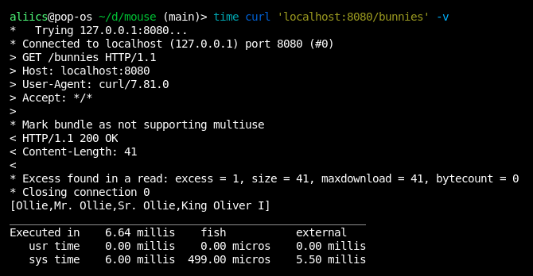

# Mouse - HTTP Server Library

Small, simple, minimal HTTP server library with no dependencies.
Since it isn't doing too much in the background, it should also be pretty darn fast.
On my machine, a query to the example `/bunnies` route takes **~6-7ms** using *curl*.



# Usage

In your build.sbt:
```scala
libraryDependencies ++= Seq(
  // ...
  "io.github.aliics" %% "mouse" % "0.4.2",
  // ...
)
```

# Example

A toy example showcasing various features `mouse` has and how to use them. These are very simple examples, but they
should be a good place start.

```scala
import mouse.Implicits._
import mouse.Method.Get
import mouse.PathParams.param
import mouse.QueryParams.{optional, required}

import scala.concurrent.ExecutionContext.Implicits.global
import scala.concurrent.Future

object HelloWorld extends App {
  val bunnies = List("Ollie", "Mr. Ollie", "Sr. Ollie", "King Oliver I")

  val routes = Routes(
    // Simple echo. Just responds with the given body.
    // Works on all methods, but in the real-world, this should probably just be a POST/PUT.
    ("echo", req => Future.successful(Ok(req.body))),

    // /hello?name=NAME will greet the name given. "name" is required, so a 400 will be
    // returned if not given.
    (Get / "hello", implicit req => Future {
      val name = required[String]("name")
      Ok(s"""Hello, $name!""")
    }),

    // /bunnies?id=OPTIONAL_ID will respond with a list of bunnies. "id" is optional, so
    // that must be handled by us. Additionally, it must be Int-parseable.
    (Get / "bunnies", implicit req => Future {
      val fetched = optional[Int]("id")
        .map(i => List(bunnies(i)))
        .getOrElse(bunnies)

      Ok(fetched.mkString("[", ",", "]"))
    }),

    // This route will always timeout because the Server is configured to a 1 second timeout
    // and the route takes 2 seconds to complete.
    ("/will-timeout", _ => Future {
      Thread.sleep(2000) // Heavy operation.
      Ok("Why didn't it timeout??")
    }),
  )

  // Routes can be concatenated, so these will be added onto our Server routes.
  val additionalRoutes = Routes(
    // This shows two need dsl features, path joining with "/" and path parameters.
    // Path params must be provided if the route uses them, so there is no optional version of the "param" function.
    (Get / "about" / ":name", implicit req => Future {
      val name = param[String]("name")
      Ok(s"$name is cool!")
    }),
  )

  // Run the server with a custom timeout (default is 30 seconds).
  new Server(routes ++ additionalRoutes, timeout = 1.second).runBlocking()
}
```
